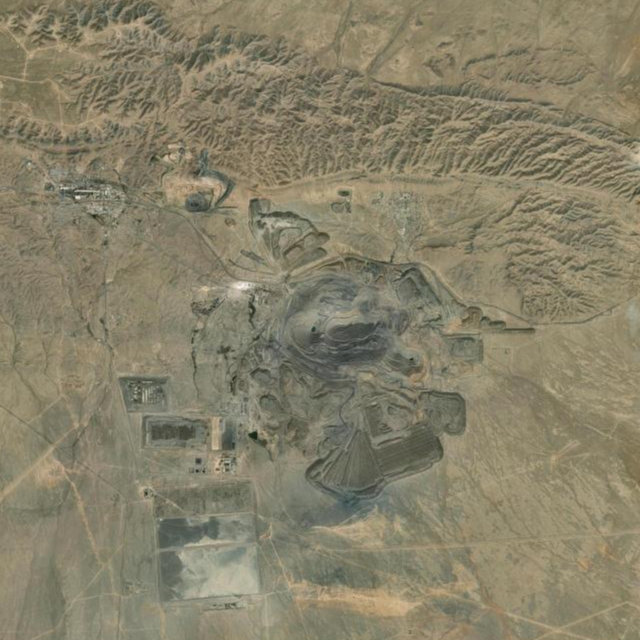
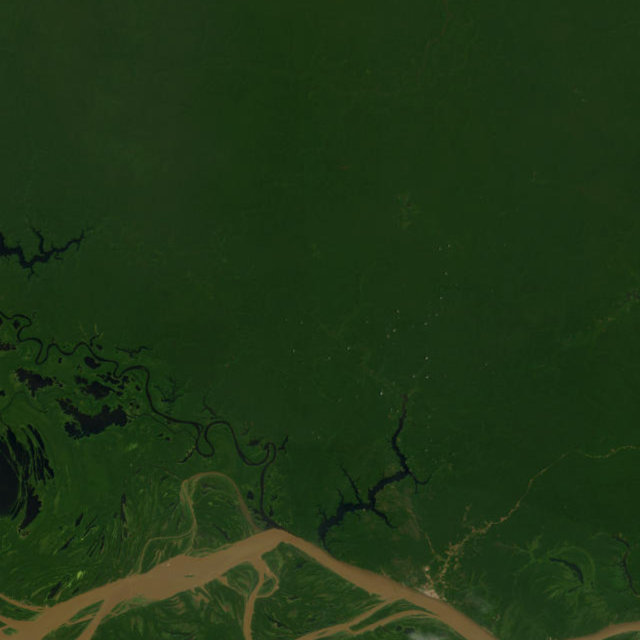
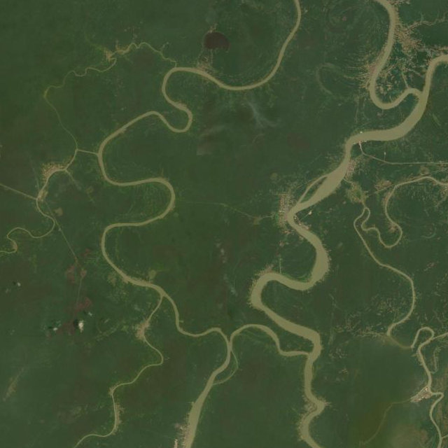

# 🌍 Project Okavango — Group M

A lightweight environmental data analysis tool built for the **Advanced Programming** course at Nova SBE.

The application automatically downloads the most recent environmental datasets from [Our World in Data](https://ourworldindata.org/), merges them with world country geometries, and presents the results in an interactive Streamlit dashboard. A second page uses locally-hosted AI models via [Ollama](https://ollama.com/) to analyse satellite imagery and classify environmental risk for any location on Earth.

---

## Group Members

| Name | Student Number | Email |
|---|---|---|
| António Santos | 71212 | 71212@novasbe.pt |
| Margarida Cunha | 71119 | 71119@novasbe.pt |
| Miguel Sardo | 71929 | 71929@novasbe.pt |
| Rafaela Castro | 71923 | 71923@novasbe.pt |

---

## Datasets

All datasets are fetched automatically at runtime — no manual downloads required.

| # | Dataset | Source |
|---|---------|--------|
| 1 | Annual Change in Forest Area | [ourworldindata.org/deforestation](https://ourworldindata.org/deforestation) |
| 2 | Annual Deforestation | [ourworldindata.org/deforestation](https://ourworldindata.org/deforestation) |
| 3 | Share of Protected Land | [ourworldindata.org/sdgs/life-on-land](https://ourworldindata.org/sdgs/life-on-land) |
| 4 | Share of Degraded Land | [ourworldindata.org/sdgs/life-on-land](https://ourworldindata.org/sdgs/life-on-land) |
| 5 | IUCN Red List Index | [ourworldindata.org/biodiversity](https://ourworldindata.org/biodiversity) |
| Map | Natural Earth 110m Admin 0 Countries | [naturalearthdata.com](https://www.naturalearthdata.com/downloads/110m-cultural-vectors/) |

---

## Project Structure

```
Group_M/
├── app/
│   └── streamlit_app.py       # Main Streamlit application (both pages)
├── okavango/
│   ├── __init__.py
│   └── data_manager.py        # OkavangoData class — download, merge, and expose datasets
├── tests/
│   ├── __init__.py
│   ├── conftest.py            # pytest path configuration
│   ├── test_download.py       # Unit tests for download_all_datasets()
│   └── test_merge.py          # Unit tests for merge_world_with_dataset()
├── notebooks/                 # Prototyping notebooks (not used in production)
├── database/
│   └── images.csv             # Lightweight CSV cache for satellite analyses
├── downloads/                 # Auto-generated — datasets and shapefiles saved here
├── images/                    # Auto-generated — cached satellite images saved here
├── models.yaml                # AI model names, prompts, and image settings
├── main.py                    # Entry point — launches the Streamlit app
├── requirements.txt
├── .gitignore
├── LICENSE
└── README.md
```

---

## Features

### 1) Data acquisition and geospatial merge

- Downloads OWID datasets dynamically (no hardcoded years).
- Downloads Natural Earth world map (`ne_110m_admin_0_countries.zip`).
- Merges each indicator to country geometries via ISO-style country code join.
- Keeps only the **most recent available year** per dataset.

### 2) Streamlit page 1 — Environmental maps

- Dataset selector for one map at a time.
- Choropleth world map.
- Top-5 and Bottom-5 country comparison table + chart.

### 3) Streamlit page 2 — Satellite + AI risk workflow

- User controls: **latitude**, **longitude**, **zoom**.
- Pulls ESRI World Imagery snapshot for selected area.
- Runs image description model (Ollama vision model).
- Runs risk-assessment model (Ollama text model) from description.
- Displays danger status with confidence and reasons.
- Stores run metadata/results in `database/images.csv`.
- Reuses cached result when same coordinates/zoom already exist.


---

## Installation & Setup

### Prerequisites

- Python ≥ 3.10
- [Ollama](https://ollama.com/) — required for the Satellite Analysis page only

### 1. Clone the Repository

```bash
git clone https://github.com/antonioncmsantos-hue/Group_M.git
cd Group_M
```

### 2. Create a Virtual Environment and Install Dependencies

```bash
python -m venv .venv

# macOS / Linux
source .venv/bin/activate

# Windows
.venv\Scripts\activate

pip install -r requirements.txt
```

### 3. Install and Start Ollama

The Satellite Analysis page requires Ollama to be installed and running locally. Download it from [ollama.com/download](https://ollama.com/download), then start the server:

```bash
# macOS
brew install ollama
ollama serve

# Linux
curl -fsSL https://ollama.com/install.sh | sh
ollama serve
```

> **Note:** The app automatically pulls the required models (`llava:7b` and `llama3.2:3b`) on first use if they are not already available. Model names and prompts can be changed in `models.yaml` without touching any code. The Maps page works without Ollama.

### 4. Run the Application

```bash
streamlit run main.py
```

The app opens at [http://localhost:8501](http://localhost:8501). On first run, all datasets and the Natural Earth shapefile are downloaded automatically into `downloads/`. Subsequent runs skip this step.

### 5. Run the Tests

All tests live in `tests/` and can be run from the project root:

```bash
pytest tests/ -v
```

The test suite uses `monkeypatch` to mock HTTP requests — no internet connection or Ollama instance is needed to run the tests.

---

## How It Works

### Data Layer — `okavango/data_manager.py`

The `OkavangoData` class drives the full data preparation workflow. On initialisation it:

1. Downloads all five OWID CSV datasets via `download_all_datasets()`.
2. Downloads the Natural Earth shapefile if not already cached locally.
3. Loads all CSVs into pandas DataFrames as instance attributes.
4. Filters each dataset to the most recent available year via `latest_year_snapshot()`.
5. Merges every dataset with the world map using `merge_world_with_dataset()`, producing one `GeoDataFrame` per indicator ready for plotting.

Configuration (download paths, map URL) is handled by `OkavangoConfig`, a pydantic `BaseModel`, making it straightforward to override settings without modifying source code.

### AI Pipeline — `app/streamlit_app.py`

The Satellite Analysis page follows a four-step pipeline:

1. **Image download** — `download_satellite_image()` builds a Web Mercator bounding box from the selected latitude, longitude, and zoom level, and fetches a 640×640 JPEG from the ESRI World Imagery service.
2. **Image description** — `describe_image_with_ollama()` sends the image to `llava:7b`, a multimodal vision model, with a prompt focused on vegetation, erosion, mining, and deforestation.
3. **Risk classification** — `assess_environmental_risk_with_ollama()` passes the generated description to `llama3.2:3b`, which returns a structured JSON response with `danger`, `confidence`, `summary`, and `reasons`.
4. **Persistence** — `append_analysis_to_database()` appends the result to `database/images.csv`. Before running the pipeline, `find_existing_analysis()` checks whether the same coordinates and zoom level already exist in the CSV — if so, the stored result is returned instantly.

### Configuration — `models.yaml`

All AI settings are externalised in `models.yaml` at the project root:

```yaml
image_analysis:
  model: "llava:7b"
  prompt: >
    Describe this satellite image. Focus on vegetation, water, roads,
    bare soil, urban expansion, mining, fire scars, erosion,
    and visible signs of deforestation or land degradation.
  temperature: 0.2

risk_analysis:
  model: "llama3.2:3b"
  prompt: >
    You are an environmental risk screening assistant...
    Return ONLY valid JSON: { "danger": ..., "confidence": ..., "summary": ..., "reasons": [...] }
  temperature: 0.2

image_settings:
  width: 640
  height: 640
  format: "jpg"
```

To swap models, update the `model` field — the app will pull the new model automatically on next run.

---

## Examples — Environmental Risk Detection

The following examples were generated by running the Satellite Analysis pipeline on real locations.

---

### Example 1 — Aral Sea Basin, Kazakhstan (High Risk)

**Location:** 41.498°N, 64.572°E — zoom 12  
**Models:** llava:7b (description) · llama3.2:3b (risk classification)

> *" [...] The image provides a comprehensive view of a landscape that is undergoing significant human influence, with mining activities, urban expansion, and signs of deforestation or land degradation. The presence of water bodies suggests that the area might be rich in resources, potentially contributing to its development and environmental changes."*




**Risk Assessment**

| | |
|---|---|
| **Danger** | Yes |
| **Confidence** | High |
| **Summary** | The satellite image reveals signs of significant environmental danger, including deforestation, land degradation, mining activities, urban expansion, and erosion, which indicate a high level of human impact on the landscape. |
| **Reasons** | Deforestation and land degradation are evident due to the presence of bare soil and scarred vegetation; Mining activities are visible in the center of the image, indicating a significant impact on the environment; Urban expansion is evident, with a growing city or town around the central part of the image, leading to increased human activity and environmental degradation; Erosion is visible, with changes in soil texture and displaced vegetation, suggesting a lack of natural stability in the landscape. |

---

### Example 2 — Amazon Basin, Brazil (High Risk)

**Location:** 3.465°S, 62.216°W — zoom 10  
**Models:** llava:7b (description) · llama3.2:3b (risk classification)



> *"[...] Overall, the image provides a glimpse into the natural landscape, highlighting features such as vegetation, water bodies, and human-induced changes like deforestation or land use conversion."*

**Risk Assessment**

| | |
|---|---|
| **Danger** | Yes |
| **Confidence** | Medium |
| **Summary** | The satellite image reveals signs of environmental danger, including deforestation, fire scars, and potential mining activity, but the overall picture suggests that the area is still relatively pristine. |
| **Reasons** | Deforestation; Fire scars; Potential mining activity |

---

### Example 3 — Niger Delta, Nigeria (High Risk)

**Location:** 4.800°N, 6.050°E — zoom 12  
**Models:** llava:7b (description) · llama3.2:3b (risk classification)



> *"[...] This image provides a snapshot of the interaction between natural and human-induced processes on Earth's surface. It is important for understanding environmental change, land management practices, and the impact of human activities on ecosystems."*

**Risk Assessment**

| | |
|---|---|
| **Danger** | Yes |
| **Confidence** | High |
| **Summary** | The satellite image reveals signs of deforestation, mining activity, wildfire scars, erosion, and urban expansion into natural land, indicating environmental danger. |
| **Reasons** | Deforestation and land degradation; mining activity with visible excavations; wildfire scars with incomplete vegetation regrowth; erosion patterns; urban encroachment into wetland and forest areas. |


---

## Contribution to the UN Sustainable Development Goals

Project Okavango was designed with the UN's 2030 Agenda in mind. The tool addresses three SDGs directly.

### SDG 15 — Life on Land

The project's data layer is built entirely around SDG 15 indicators. Four of the five datasets — annual change in forest area, annual deforestation, share of protected land, and share of degraded land — directly measure the state of terrestrial ecosystems. The choropleth maps make it immediately visible which countries are losing or gaining forest cover, which regions have invested in land protection, and where degradation is accelerating. The Red List Index adds a biodiversity lens, linking land health to species survival rates. Together, these layers give researchers and policymakers a country-level picture of the SDG 15 targets in a single, accessible tool.

### SDG 13 — Climate Action

Forests are critical carbon sinks. Every hectare of forest destroyed releases stored carbon and reduces the planet's future absorption capacity. By mapping deforestation trends at country level and flagging specific high-risk locations through satellite analysis, the tool connects land-use decisions directly to climate outcomes. The AI risk pipeline supports early-warning monitoring — identifying areas undergoing rapid degradation before the damage becomes irreversible. This kind of real-time, location-specific insight is exactly the type of tool that national climate action plans and NGO field teams need to prioritise intervention.

### SDG 11 — Sustainable Cities and Communities

Urban expansion is one of the most visible environmental pressures in the satellite imagery analysed by the app. Several of the detections flagged as high risk show roads, buildings, and cleared land encroaching on previously natural areas. By surfacing these patterns and making them classifiable through AI, the tool can help urban planners and local governments understand the environmental footprint of development decisions. Sustainable city growth requires knowing where natural buffers are being lost — and this tool puts that information at anyone's fingertips.

---

## License

This project is licensed under the [MIT License](LICENSE).
